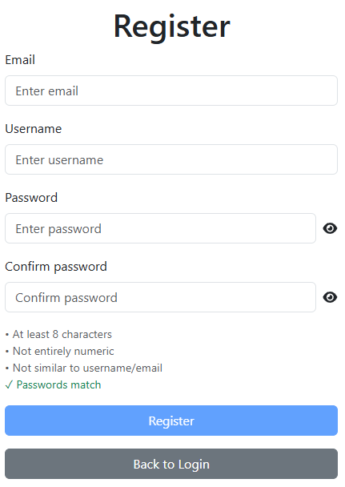
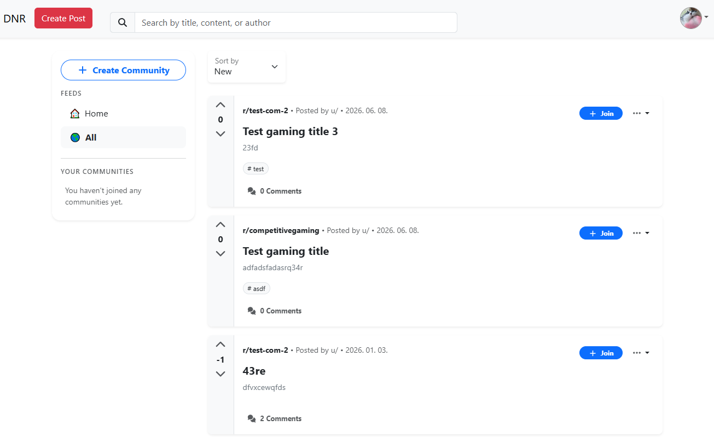
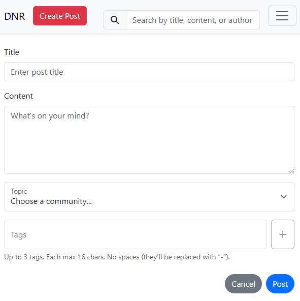
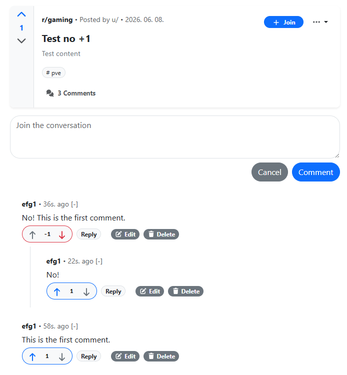

# Reddit Mini

A full-stack, Reddit-inspired web application. Users can create communities and posts, engage through threaded comments and voting, and manage their profiles.

---

## Features

### Authentication & Accounts

- Register and log in with JWT-based authentication (30-minute session)
- Password validation on registration: minimum 8 characters, not purely numeric, similarity check against username/email, and password confirmation match
- Change password or permanently delete account

### Posts

- Create, edit, and delete posts
- Assign posts to a community
- Attach tags to posts
- Search posts — sort results by date, most popular, or least popular

### Comments

- Comment on posts and reply to comments (nested reply system)
- Upvote and downvote on posts and comments

### Communities

- Create communities (topics/subreddits)
- Posts can belong to a specific community

### Profiles

- Users can see theri own post and comment history
- Write a short bio
- Upload a profile picture

---

## Screenshots






---

## Tech Stack

|          |                                         |
| -------- | --------------------------------------- |
| Backend  | Python · Django · Django REST Framework |
| Frontend | React · JavaScript                      |
| Auth     | JWT (`djangorestframework-simplejwt`)   |
| Database | PostgreSQL                              |

---

## Getting Started

### Prerequisites

- Python 3.10+
- Node.js 18+

### Backend

```bash
cd backend
pip install -r requirements.txt
```

Rename the `.env.sample` files to .env from `backend/` and `frontend/` directory and fill in the values.

### Create virtual environment:

```bash
python - venv venv
```

### Activate virtual environment:

Windows:

```
venv\Scripts\activate
or
source venv/Scripts/activate
```

Linux/macOS:

```
source venv/bin/activate
```

### Run server:

```
python manage.py migrate
python manage.py runserver
```

API runs at `http://localhost:8000`.

### Frontend

```bash
cd frontend
npm install
npm run dev
```

App runs at `http://localhost:5173`.

---

## Planned features

- Role system (admin, moderator)
- Content reporting
- Community discovery and search

---
